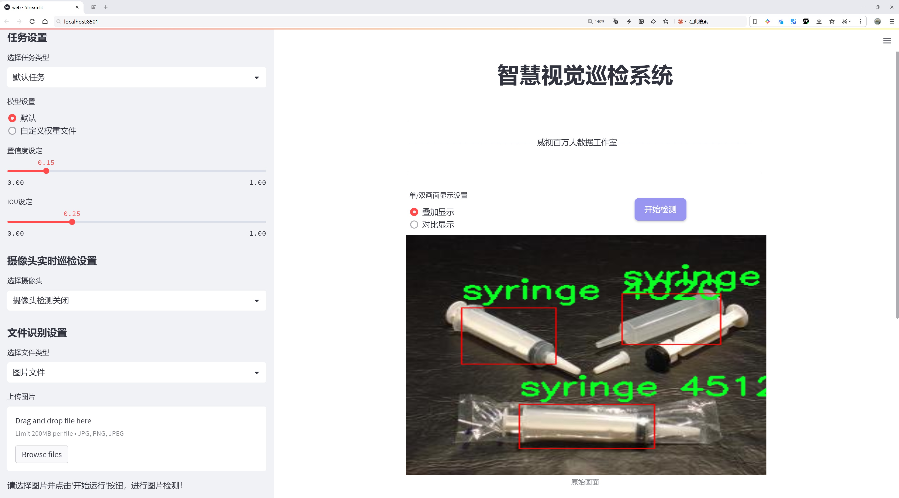
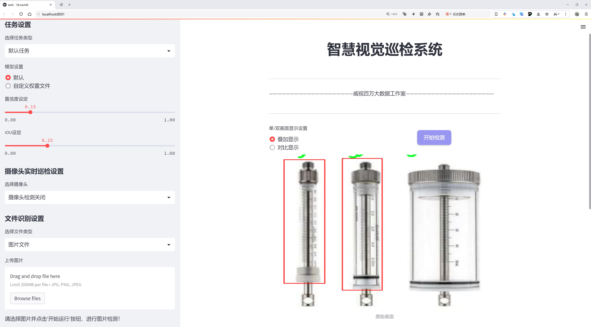
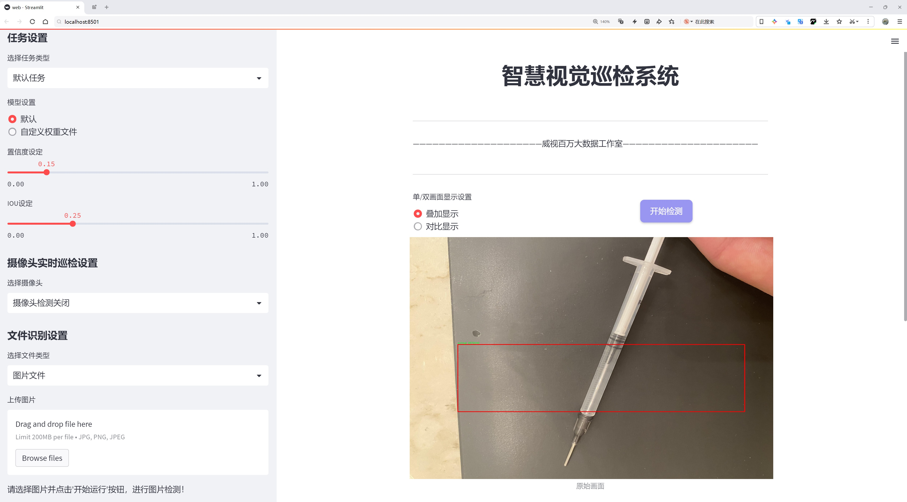
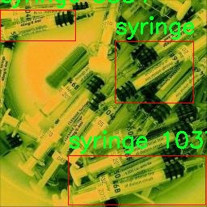
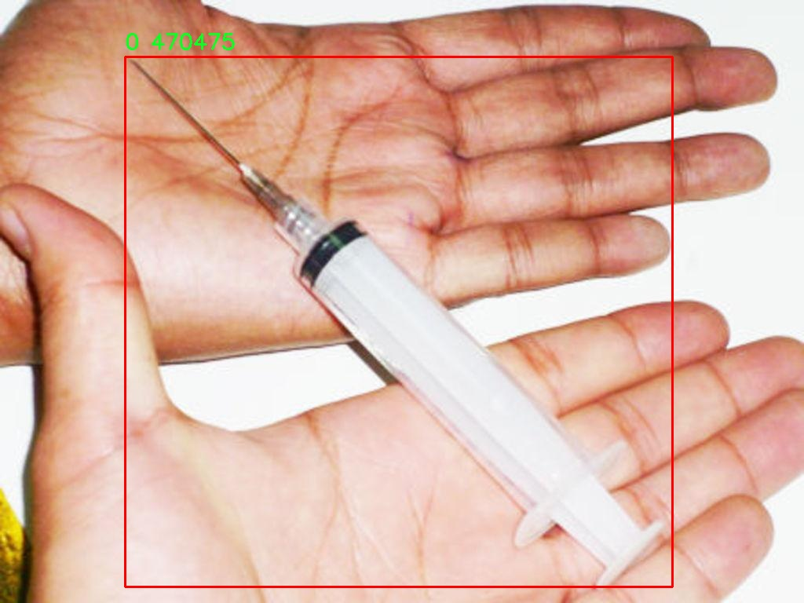
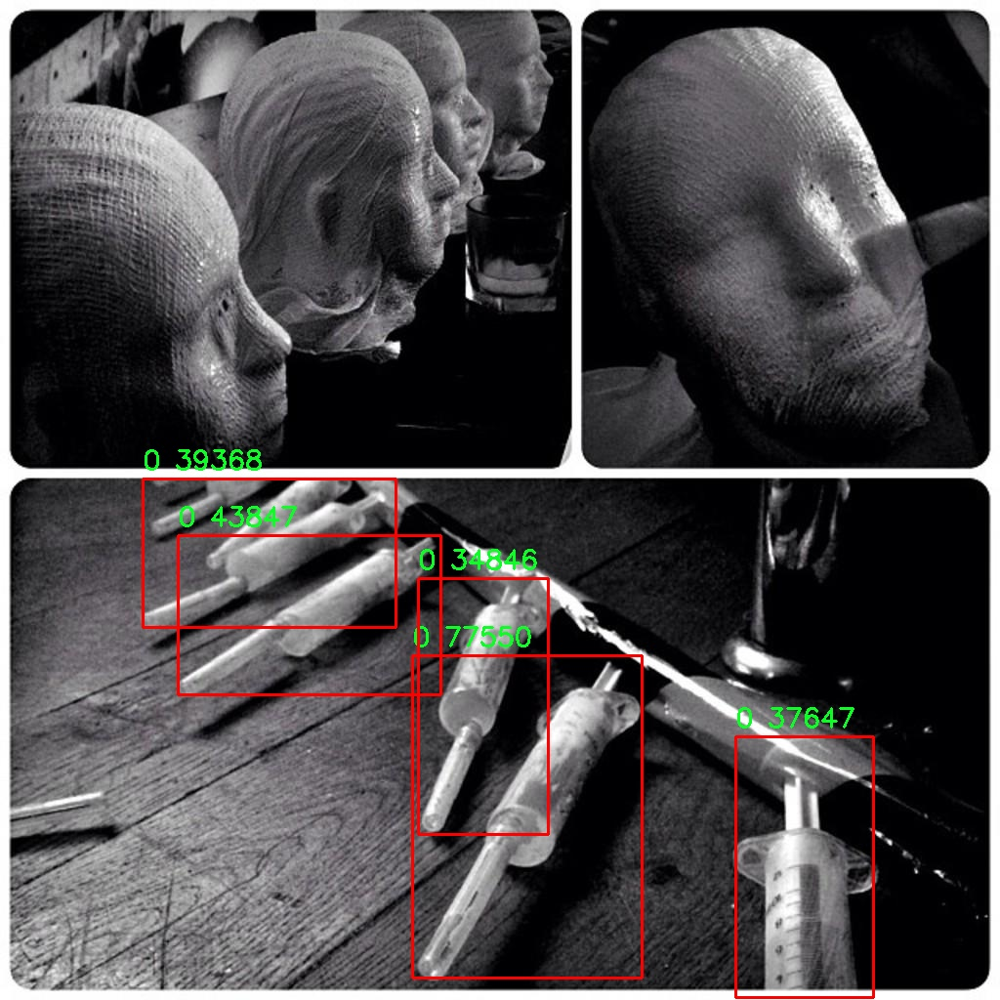
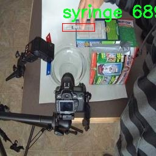
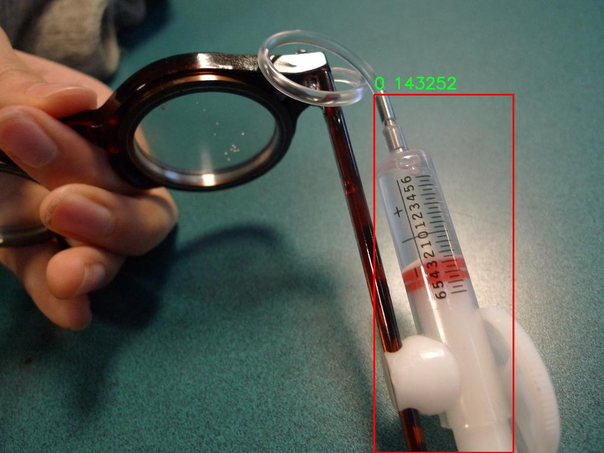

# 注射器检测检测系统源码分享
 # [一条龙教学YOLOV8标注好的数据集一键训练_70+全套改进创新点发刊_Web前端展示]

### 1.研究背景与意义

项目参考[AAAI Association for the Advancement of Artificial Intelligence](https://gitee.com/qunmasj/projects)

项目来源[AACV Association for the Advancement of Computer Vision](https://kdocs.cn/l/cszuIiCKVNis)

研究背景与意义

随着医疗技术的不断进步，注射器作为一种重要的医疗器械，广泛应用于临床治疗、疫苗接种和药物输送等多个领域。然而，注射器的使用也伴随着一定的风险，包括误用、滥用以及在医疗环境中的错误处理等。因此，开发一种高效、准确的注射器检测系统显得尤为重要。这不仅有助于提高医疗安全性，还能在一定程度上降低医疗成本，提升医疗服务的质量。

近年来，深度学习技术在计算机视觉领域取得了显著进展，尤其是目标检测算法的快速发展，使得物体识别的准确性和实时性得到了极大的提升。YOLO（You Only Look Once）系列算法因其高效性和准确性而受到广泛关注。YOLOv8作为该系列的最新版本，进一步优化了模型的结构和算法，使其在目标检测任务中表现出色。然而，针对特定领域的应用，尤其是医疗器械的检测，仍然存在改进的空间。因此，基于改进YOLOv8的注射器检测系统的研究具有重要的现实意义。

本研究所使用的数据集包含1800张图像，涵盖了4个类别，其中包括注射器的不同类型和状态。这一数据集为模型的训练和测试提供了丰富的样本，能够有效提高模型的泛化能力和检测精度。通过对这些图像的深入分析，可以识别出注射器在不同环境下的特征，包括光照变化、背景复杂度等因素对检测效果的影响。此外，数据集中对注射器的多样性描述，也为模型的鲁棒性提供了良好的基础。

在研究过程中，我们将对YOLOv8进行改进，主要集中在模型结构的优化和数据增强技术的应用上。通过引入更为先进的特征提取模块和优化的损失函数，我们期望提升模型在复杂场景下的检测能力。同时，采用数据增强技术，可以有效扩展训练样本的多样性，减少模型对特定样本的过拟合现象。这一系列改进将有助于提升注射器检测系统的准确性和实时性，使其能够在实际应用中发挥更大的作用。

此外，基于改进YOLOv8的注射器检测系统不仅可以应用于医院、诊所等医疗机构，还可以扩展到药品生产、物流运输等领域，确保注射器的安全使用和管理。这一研究的成功实施，将为医疗器械的智能化管理提供有力支持，推动医疗行业的数字化转型。

综上所述，基于改进YOLOv8的注射器检测系统的研究，不仅具有重要的学术价值，也具备广泛的应用前景。通过深入探讨目标检测技术在医疗器械领域的应用，我们期望为提升医疗安全、优化医疗资源配置贡献一份力量。

### 2.图片演示







##### 注意：由于此博客编辑较早，上面“2.图片演示”和“3.视频演示”展示的系统图片或者视频可能为老版本，新版本在老版本的基础上升级如下：（实际效果以升级的新版本为准）

  （1）适配了YOLOV8的“目标检测”模型和“实例分割”模型，通过加载相应的权重（.pt）文件即可自适应加载模型。

  （2）支持“图片识别”、“视频识别”、“摄像头实时识别”三种识别模式。

  （3）支持“图片识别”、“视频识别”、“摄像头实时识别”三种识别结果保存导出，解决手动导出（容易卡顿出现爆内存）存在的问题，识别完自动保存结果并导出到tempDir中。

  （4）支持Web前端系统中的标题、背景图等自定义修改，后面提供修改教程。

  另外本项目提供训练的数据集和训练教程,暂不提供权重文件（best.pt）,需要您按照教程进行训练后实现图片演示和Web前端界面演示的效果。

### 3.视频演示

[3.1 视频演示](https://www.bilibili.com/video/BV1MAsreJEKu/)

### 4.数据集信息展示

##### 4.1 本项目数据集详细数据（类别数＆类别名）

nc: 3
names: ['.', '0', 'syringe']


##### 4.2 本项目数据集信息介绍

数据集信息展示

在本研究中，我们使用了名为“syringe detection”的数据集，以改进YOLOv8模型在注射器检测任务中的性能。该数据集专门设计用于训练和评估计算机视觉算法，尤其是在医疗和生物科学领域中对注射器的自动检测与识别。数据集的类别数量为三，具体类别包括：背景（.）、非注射器物体（0）以及注射器（syringe）。这种类别划分使得模型能够在复杂的场景中有效地区分注射器与其他物体，从而提高检测的准确性和鲁棒性。

数据集中的图像样本涵盖了多种场景和环境，以确保模型在不同条件下的泛化能力。样本中包含了各种类型的注射器，包括不同的尺寸、颜色和形状，反映了实际应用中可能遇到的多样性。此外，数据集中还包含了多种背景环境，例如医院、实验室和家庭场景等，这些背景的多样性有助于模型学习到如何在不同的环境中进行有效的物体检测。

为了增强模型的训练效果，数据集采用了数据增强技术，如随机裁剪、旋转、缩放和颜色变换等。这些技术不仅增加了数据集的样本数量，还提高了模型对不同视觉变换的适应能力。通过这些手段，模型能够更好地应对实际应用中可能出现的各种情况，从而提升注射器检测的准确性和可靠性。

在标注方面，数据集采用了精确的边界框标注技术，对每个注射器样本进行了详细的标注。这些标注信息不仅包括注射器的位置和大小，还提供了相应的类别标签，使得模型在训练过程中能够清晰地识别和学习不同类别的特征。这种高质量的标注为模型的训练提供了坚实的基础，确保了检测结果的准确性。

在训练过程中，我们将数据集分为训练集和验证集，以便于对模型的性能进行评估。训练集用于模型的学习，而验证集则用于监测模型在未见数据上的表现。通过这种方式，我们能够及时调整模型的参数和结构，以达到最佳的检测效果。

综上所述，“syringe detection”数据集为改进YOLOv8的注射器检测系统提供了丰富而多样的训练素材。通过合理的类别划分、数据增强和精确的标注，该数据集不仅提升了模型的学习能力，也为后续的应用研究奠定了坚实的基础。随着模型性能的不断提升，我们期望能够在实际应用中实现更高效、更准确的注射器检测，为医疗和生物科学领域的自动化发展贡献力量。











### 5.全套项目环境部署视频教程（零基础手把手教学）

[5.1 环境部署教程链接（零基础手把手教学）](https://www.ixigua.com/7404473917358506534?logTag=c807d0cbc21c0ef59de5)


[5.2 安装Python虚拟环境创建和依赖库安装视频教程链接（零基础手把手教学）](https://www.ixigua.com/7404474678003106304?logTag=1f1041108cd1f708b01a)

### 6.手把手YOLOV8训练视频教程（零基础小白有手就能学会）

[6.1 手把手YOLOV8训练视频教程（零基础小白有手就能学会）](https://www.ixigua.com/7404477157818401292?logTag=d31a2dfd1983c9668658)

### 7.70+种全套YOLOV8创新点代码加载调参视频教程（一键加载写好的改进模型的配置文件）

[7.1 70+种全套YOLOV8创新点代码加载调参视频教程（一键加载写好的改进模型的配置文件）](https://www.ixigua.com/7404478314661806627?logTag=29066f8288e3f4eea3a4)

### 8.70+种全套YOLOV8创新点原理讲解（非科班也可以轻松写刊发刊，V10版本正在科研待更新）

由于篇幅限制，每个创新点的具体原理讲解就不一一展开，具体见下列网址中的创新点对应子项目的技术原理博客网址【Blog】：


[8.1 70+种全套YOLOV8创新点原理讲解链接](https://gitee.com/qunmasj/good)

### 9.系统功能展示（检测对象为举例，实际内容以本项目数据集为准）

图9.1.系统支持检测结果表格显示

  图9.2.系统支持置信度和IOU阈值手动调节

  图9.3.系统支持自定义加载权重文件best.pt(需要你通过步骤5中训练获得)

  图9.4.系统支持摄像头实时识别

  图9.5.系统支持图片识别

  图9.6.系统支持视频识别

  图9.7.系统支持识别结果文件自动保存

  图9.8.系统支持Excel导出检测结果数据


### 10.原始YOLOV8算法原理

原始YOLOv8算法原理

YOLOv8作为YOLO系列中的最新一代目标检测算法，延续了YOLO家族的设计理念，旨在通过高效的网络结构和创新的训练策略，进一步提升目标检测的精度和速度。YOLOv8的设计分为多个模块，包括输入端、主干网络、特征增强网络和检测头，每个模块都经过精心设计，以适应不同的应用场景和需求。

在输入端，YOLOv8采用了马赛克数据增强技术，这种方法通过将多张图像拼接在一起，生成新的训练样本，从而增加了模型的鲁棒性和泛化能力。此外，YOLOv8还引入了自适应锚框计算和自适应灰度填充，这些技术的应用使得模型能够更好地适应不同的图像特征和目标形状，进一步提升了检测效果。

主干网络部分，YOLOv8依然采用了CSP（Cross Stage Partial）网络的思想，但在具体实现上进行了优化。C2f模块的引入是YOLOv8的一大创新，这一模块在YOLOv5的C3结构基础上进行了改进，结合了YOLOv7中的ELAN模块的设计理念。C2f模块通过增加残差连接，增强了网络的梯度流动，使得模型在训练过程中能够更有效地学习到丰富的特征表示。这种设计不仅提高了模型的特征提取能力，还在保持轻量化的基础上，显著提升了检测精度。

特征增强网络采用了PAN-FPN（Path Aggregation Network with Feature Pyramid Network）的结构，这一设计使得YOLOv8能够在不同尺度的特征图之间进行有效的特征融合。PAN-FPN的引入，使得模型在处理多尺度目标时，能够更好地捕捉到不同层次的特征信息，从而提升了对小目标和大目标的检测能力。

在检测头部分，YOLOv8进行了重要的结构性改进。与以往的耦合头结构不同，YOLOv8采用了解耦合头的设计，将分类和回归任务分开处理。这种解耦合的方式使得模型能够更加专注于各自的任务，从而减少了复杂场景下的定位误差和分类错误。此外，YOLOv8还采用了Anchor-Free的目标检测方法，这一方法通过直接回归目标的位置和大小，避免了传统锚框方法中锚框选择和调整的繁琐过程，使得模型在预测时能够更快地聚焦于目标位置，提升了检测效率。

在训练过程中，YOLOv8引入了动态的Task-Aligned Assigner样本分配策略，该策略根据分类和回归的分数加权结果选择正样本，确保模型在训练时能够接收到更为有效的样本信息。这一策略的应用，进一步提升了模型的训练效果，使得YOLOv8在处理复杂场景时表现得更加出色。

损失计算方面，YOLOv8采用了BCELoss作为分类损失，DFLoss和CIoULoss作为回归损失。BCELoss的使用使得模型在分类任务中能够更好地处理二分类问题，而DFLoss和CIoULoss的结合则提升了模型对边界框预测的精准性。这种多损失函数的设计，使得YOLOv8在训练过程中能够综合考虑分类和回归的性能，从而实现更优的检测效果。

YOLOv8的网络结构设计充分考虑了不同应用场景的需求，提供了n、s、m、l、x五种不同尺度的模型，以适应不同的计算资源和实时性要求。其中，YOLOv8n作为参数量最小且检测速度最快的版本，特别适合在资源受限的嵌入式设备上进行部署。这种灵活的模型设计，使得YOLOv8能够在各种实际应用中发挥出色的性能。

综上所述，YOLOv8在原始YOLO算法的基础上，通过引入新的网络结构、创新的训练策略和灵活的模型设计，极大地提升了目标检测的精度和速度。其解耦合头结构和Anchor-Free方法的应用，标志着目标检测领域的一次重要进步，为实时检测任务提供了更为高效的解决方案。随着YOLOv8的推广和应用，预计将会在智能监控、自动驾驶、无人机视觉等多个领域发挥重要作用。


### 11.项目核心源码讲解（再也不用担心看不懂代码逻辑）

#### 11.1 ui.py

以下是对给定代码的核心部分进行提炼和详细注释的版本：

```python
import sys  # 导入sys模块，用于访问与Python解释器紧密相关的变量和函数
import subprocess  # 导入subprocess模块，用于执行外部命令

def run_script(script_path):
    """
    使用当前 Python 环境运行指定的脚本。

    Args:
        script_path (str): 要运行的脚本路径

    Returns:
        None
    """
    # 获取当前 Python 解释器的路径
    python_path = sys.executable

    # 构建运行命令，使用streamlit运行指定的脚本
    command = f'"{python_path}" -m streamlit run "{script_path}"'

    # 执行命令
    result = subprocess.run(command, shell=True)  # 使用subprocess.run执行命令
    if result.returncode != 0:  # 检查命令执行是否成功
        print("脚本运行出错。")  # 如果返回码不为0，表示出错，打印错误信息

# 实例化并运行应用
if __name__ == "__main__":
    # 指定要运行的脚本路径
    script_path = "web.py"  # 这里直接指定脚本名称，假设在当前目录下

    # 运行脚本
    run_script(script_path)  # 调用run_script函数，传入脚本路径
```

### 代码分析：
1. **模块导入**：
   - `sys`模块用于获取当前Python解释器的路径。
   - `subprocess`模块用于在Python中执行外部命令。

2. **`run_script`函数**：
   - 接受一个参数`script_path`，表示要运行的Python脚本的路径。
   - 使用`sys.executable`获取当前Python解释器的路径。
   - 构建一个命令字符串，用于通过`streamlit`运行指定的脚本。
   - 使用`subprocess.run`执行该命令，并检查返回码以确定脚本是否成功运行。

3. **主程序部分**：
   - 使用`if __name__ == "__main__":`确保只有在直接运行该脚本时才会执行以下代码。
   - 指定要运行的脚本路径为`web.py`。
   - 调用`run_script`函数来执行该脚本。

### 注意事项：
- 在实际使用中，`script_path`的值可以根据需要进行修改，以指向不同的脚本。
- 确保`streamlit`库已安装并可用，以避免运行时错误。

这个程序文件 `ui.py` 的主要功能是通过当前的 Python 环境来运行一个指定的脚本，具体是使用 Streamlit 来启动一个 Web 应用。程序首先导入了必要的模块，包括 `sys`、`os` 和 `subprocess`，以及一个自定义的 `abs_path` 函数，这个函数可能用于获取脚本的绝对路径。

在 `run_script` 函数中，首先获取当前 Python 解释器的路径，这通过 `sys.executable` 实现。接着，构建一个命令字符串，这个命令使用当前的 Python 解释器来运行指定的脚本，并且通过 Streamlit 的命令行接口来启动它。命令的格式是 `"{python_path}" -m streamlit run "{script_path}"`，其中 `script_path` 是要运行的脚本的路径。

随后，使用 `subprocess.run` 方法来执行这个命令。这个方法会在一个新的子进程中运行命令，并等待其完成。如果命令的返回码不为零，表示脚本运行过程中出现了错误，程序会打印出“脚本运行出错”的提示信息。

在文件的最后部分，使用 `if __name__ == "__main__":` 语句来确保只有在直接运行该文件时才会执行以下代码。这里指定了要运行的脚本路径为 `web.py`，并调用 `run_script` 函数来启动这个脚本。

总体来说，这个文件的作用是提供一个简单的接口，通过命令行来启动一个 Streamlit Web 应用，方便用户在本地环境中进行开发和测试。

#### 11.2 70+种YOLOv8算法改进源码大全和调试加载训练教程（非必要）\ultralytics\nn\backbone\fasternet.py

以下是提取后的核心代码部分，并附上详细的中文注释：

```python
import torch
import torch.nn as nn
from typing import List
from torch import Tensor

class Partial_conv3(nn.Module):
    """
    实现部分卷积的类，支持两种前向传播方式：切片和拼接。
    """
    def __init__(self, dim, n_div, forward):
        super().__init__()
        self.dim_conv3 = dim // n_div  # 部分卷积的通道数
        self.dim_untouched = dim - self.dim_conv3  # 未被卷积的通道数
        self.partial_conv3 = nn.Conv2d(self.dim_conv3, self.dim_conv3, 3, 1, 1, bias=False)  # 定义卷积层

        # 根据前向传播方式选择对应的函数
        if forward == 'slicing':
            self.forward = self.forward_slicing
        elif forward == 'split_cat':
            self.forward = self.forward_split_cat
        else:
            raise NotImplementedError

    def forward_slicing(self, x: Tensor) -> Tensor:
        # 仅用于推理阶段
        x = x.clone()  # 克隆输入以保持原始输入不变
        x[:, :self.dim_conv3, :, :] = self.partial_conv3(x[:, :self.dim_conv3, :, :])  # 进行部分卷积
        return x

    def forward_split_cat(self, x: Tensor) -> Tensor:
        # 用于训练和推理阶段
        x1, x2 = torch.split(x, [self.dim_conv3, self.dim_untouched], dim=1)  # 按通道分割
        x1 = self.partial_conv3(x1)  # 对分割后的部分进行卷积
        x = torch.cat((x1, x2), 1)  # 拼接卷积后的部分和未卷积的部分
        return x


class MLPBlock(nn.Module):
    """
    实现多层感知机（MLP）块，包含卷积、归一化和激活函数。
    """
    def __init__(self, dim, n_div, mlp_ratio, drop_path, layer_scale_init_value, act_layer, norm_layer, pconv_fw_type):
        super().__init__()
        self.dim = dim
        self.mlp_ratio = mlp_ratio
        self.drop_path = nn.Identity() if drop_path <= 0 else DropPath(drop_path)  # 选择是否使用DropPath
        self.n_div = n_div

        mlp_hidden_dim = int(dim * mlp_ratio)  # 计算隐藏层维度

        # 定义MLP层
        mlp_layer: List[nn.Module] = [
            nn.Conv2d(dim, mlp_hidden_dim, 1, bias=False),
            norm_layer(mlp_hidden_dim),
            act_layer(),
            nn.Conv2d(mlp_hidden_dim, dim, 1, bias=False)
        ]
        self.mlp = nn.Sequential(*mlp_layer)  # 将MLP层组合成序列

        # 定义空间混合层
        self.spatial_mixing = Partial_conv3(dim, n_div, pconv_fw_type)

    def forward(self, x: Tensor) -> Tensor:
        shortcut = x  # 保存输入以用于残差连接
        x = self.spatial_mixing(x)  # 进行空间混合
        x = shortcut + self.drop_path(self.mlp(x))  # 残差连接
        return x


class FasterNet(nn.Module):
    """
    FasterNet模型的实现，包含多个阶段和块。
    """
    def __init__(self, in_chans=3, num_classes=1000, embed_dim=96, depths=(1, 2, 8, 2), mlp_ratio=2., n_div=4,
                 patch_size=4, patch_stride=4, patch_size2=2, patch_stride2=2, patch_norm=True, drop_path_rate=0.1,
                 layer_scale_init_value=0, norm_layer='BN', act_layer='RELU', pconv_fw_type='split_cat'):
        super().__init__()

        # 选择归一化和激活函数
        norm_layer = nn.BatchNorm2d if norm_layer == 'BN' else NotImplementedError
        act_layer = nn.GELU if act_layer == 'GELU' else partial(nn.ReLU, inplace=True)

        self.num_stages = len(depths)  # 模型阶段数
        self.embed_dim = embed_dim  # 嵌入维度
        self.depths = depths  # 每个阶段的深度

        # 将输入图像分割为不重叠的补丁
        self.patch_embed = PatchEmbed(patch_size=patch_size, patch_stride=patch_stride, in_chans=in_chans,
                                      embed_dim=embed_dim, norm_layer=norm_layer if patch_norm else None)

        # 构建每个阶段的层
        stages_list = []
        for i_stage in range(self.num_stages):
            stage = BasicStage(dim=int(embed_dim * 2 ** i_stage), n_div=n_div, depth=depths[i_stage],
                               mlp_ratio=mlp_ratio, drop_path=drop_path_rate, layer_scale_init_value=layer_scale_init_value,
                               norm_layer=norm_layer, act_layer=act_layer, pconv_fw_type=pconv_fw_type)
            stages_list.append(stage)

            # 添加补丁合并层
            if i_stage < self.num_stages - 1:
                stages_list.append(PatchMerging(patch_size2=patch_size2, patch_stride2=patch_stride2,
                                                 dim=int(embed_dim * 2 ** i_stage), norm_layer=norm_layer))

        self.stages = nn.Sequential(*stages_list)  # 将所有阶段组合成序列

    def forward(self, x: Tensor) -> Tensor:
        # 输出四个阶段的特征用于密集预测
        x = self.patch_embed(x)  # 进行补丁嵌入
        outs = []
        for idx, stage in enumerate(self.stages):
            x = stage(x)  # 通过每个阶段
            outs.append(x)  # 保存输出
        return outs
```

### 代码说明：
1. **Partial_conv3**：实现了部分卷积，支持两种前向传播方式，适用于不同的场景（推理或训练）。
2. **MLPBlock**：实现了多层感知机块，包含卷积、归一化和激活函数，支持残差连接。
3. **FasterNet**：主模型类，负责构建整个网络结构，包括补丁嵌入、多个阶段和补丁合并层。通过前向传播输出特征图。

以上是核心代码部分及其详细注释，帮助理解模型的结构和功能。

这个程序文件是一个实现了FasterNet模型的PyTorch代码，主要用于计算机视觉任务。代码的结构清晰，分为多个类和函数，具体实现了FasterNet的各个组成部分。

首先，文件导入了必要的库，包括PyTorch、YAML和一些神经网络模块。接着，定义了一些类，这些类是FasterNet模型的基本构建块。

`Partial_conv3`类实现了一个部分卷积层，支持两种前向传播方式：切片（slicing）和拼接（split_cat）。这两种方式在模型的推理和训练阶段分别使用，目的是在保留输入的同时进行卷积操作。

`MLPBlock`类实现了一个多层感知机块，包含了卷积层、归一化层和激活函数。它还使用了`Partial_conv3`进行空间混合，并根据是否启用层级缩放来决定前向传播的具体实现。

`BasicStage`类则是由多个`MLPBlock`组成的一个阶段，用于构建FasterNet的各个阶段。

`PatchEmbed`和`PatchMerging`类分别用于图像的嵌入和合并操作，前者将输入图像分割成不重叠的补丁并进行卷积，后者则在特征图上进行降维。

`FasterNet`类是整个模型的核心，负责构建整个网络结构。它根据输入的参数设置不同的阶段、层数和特征维度，并定义了前向传播的方法。在前向传播中，输入图像首先经过补丁嵌入，然后依次通过各个阶段，最后输出特征。

接下来，定义了一些函数来加载不同配置的FasterNet模型（如`fasternet_t0`、`fasternet_t1`等）。这些函数会读取配置文件并根据配置构建模型，同时可以加载预训练权重。

最后，在主程序中，创建了一个FasterNet模型实例，并对输入进行前向传播，输出各个阶段的特征图尺寸。

整体而言，这段代码实现了FasterNet模型的构建和前向传播，适用于图像分类或其他计算机视觉任务。通过模块化的设计，代码易于扩展和修改，便于研究和应用。

#### 11.3 code\ultralytics\data\augment.py

以下是经过简化和注释的核心代码部分，主要集中在图像增强和变换的实现上：

```python
import random
import numpy as np
import cv2

class BaseTransform:
    """
    基础图像变换类，提供基本的图像处理方法。
    """

    def __init__(self) -> None:
        """初始化基础变换对象。"""
        pass

    def apply_image(self, labels):
        """应用图像变换到标签。"""
        pass

    def apply_instances(self, labels):
        """应用变换到标签中的物体实例。"""
        pass

    def apply_semantic(self, labels):
        """应用语义分割到图像。"""
        pass

    def __call__(self, labels):
        """应用所有标签变换到图像、实例和语义掩码。"""
        self.apply_image(labels)
        self.apply_instances(labels)
        self.apply_semantic(labels)


class Mosaic(BaseTransform):
    """
    马赛克增强类，通过将多个图像组合成一个马赛克图像来增强数据。
    """

    def __init__(self, dataset, imgsz=640, p=1.0, n=4):
        """初始化马赛克对象，设置数据集、图像大小、概率和网格大小。"""
        assert 0 <= p <= 1.0, f"概率应在[0, 1]范围内，但得到{p}。"
        assert n in (4, 9), "网格大小必须为4或9。"
        self.dataset = dataset
        self.imgsz = imgsz
        self.n = n

    def get_indexes(self):
        """从数据集中返回随机索引列表。"""
        return random.sample(range(len(self.dataset)), self.n - 1)

    def _mix_transform(self, labels):
        """应用马赛克增强到标签字典。"""
        return self._mosaic4(labels) if self.n == 4 else self._mosaic9(labels)

    def _mosaic4(self, labels):
        """创建一个2x2的图像马赛克。"""
        mosaic_labels = []
        s = self.imgsz
        img4 = np.full((s * 2, s * 2, 3), 114, dtype=np.uint8)  # 创建基础图像
        for i in range(4):
            labels_patch = labels if i == 0 else labels["mix_labels"][i - 1]
            img = labels_patch["img"]
            h, w = labels_patch.pop("resized_shape")

            # 将图像放置在马赛克图像的适当位置
            if i == 0:  # 左上角
                img4[:h, :w] = img
            elif i == 1:  # 右上角
                img4[:h, s:s + w] = img
            elif i == 2:  # 左下角
                img4[s:s + h, :w] = img
            elif i == 3:  # 右下角
                img4[s:s + h, s:s + w] = img

            # 更新标签
            mosaic_labels.append(labels_patch)

        final_labels = self._cat_labels(mosaic_labels)
        final_labels["img"] = img4
        return final_labels

    def _cat_labels(self, mosaic_labels):
        """返回带有马赛克边界实例剪裁的标签。"""
        cls = []
        instances = []
        for labels in mosaic_labels:
            cls.append(labels["cls"])
            instances.append(labels["instances"])
        final_labels = {
            "cls": np.concatenate(cls, 0),
            "instances": Instances.concatenate(instances, axis=0),
        }
        return final_labels


class RandomFlip:
    """
    随机翻转类，随机水平或垂直翻转图像。
    """

    def __init__(self, p=0.5, direction="horizontal") -> None:
        """初始化随机翻转对象，设置翻转概率和方向。"""
        assert direction in ["horizontal", "vertical"], f"支持的方向为`horizontal`或`vertical`，但得到{direction}"
        assert 0 <= p <= 1.0
        self.p = p
        self.direction = direction

    def __call__(self, labels):
        """应用随机翻转到图像和实例。"""
        img = labels["img"]
        if self.direction == "vertical" and random.random() < self.p:
            img = np.flipud(img)  # 垂直翻转
        if self.direction == "horizontal" and random.random() < self.p:
            img = np.fliplr(img)  # 水平翻转
        labels["img"] = img
        return labels


class RandomHSV:
    """
    随机调整图像的色调、饱和度和亮度（HSV）通道。
    """

    def __init__(self, hgain=0.5, sgain=0.5, vgain=0.5) -> None:
        """初始化随机HSV对象，设置每个通道的增益。"""
        self.hgain = hgain
        self.sgain = sgain
        self.vgain = vgain

    def __call__(self, labels):
        """应用随机HSV增强到图像。"""
        img = labels["img"]
        if self.hgain or self.sgain or self.vgain:
            r = np.random.uniform(-1, 1, 3) * [self.hgain, self.sgain, self.vgain] + 1  # 随机增益
            hue, sat, val = cv2.split(cv2.cvtColor(img, cv2.COLOR_BGR2HSV))
            # 应用增益并合并通道
            img = cv2.merge((cv2.LUT(hue, ((np.arange(0, 256) * r[0]) % 180).astype(img.dtype)),
                               cv2.LUT(sat, np.clip(np.arange(0, 256) * r[1], 0, 255).astype(img.dtype)),
                               cv2.LUT(val, np.clip(np.arange(0, 256) * r[2], 0, 255).astype(img.dtype))))
        labels["img"] = img
        return labels
```

### 代码说明
1. **BaseTransform**: 这是一个基础类，定义了图像变换的基本接口，子类需要实现具体的变换方法。
2. **Mosaic**: 该类实现了马赛克增强，通过将多个图像组合成一个马赛克图像来增强数据集。
3. **RandomFlip**: 该类实现了随机翻转功能，可以随机选择水平或垂直翻转图像。
4. **RandomHSV**: 该类实现了随机调整图像的色调、饱和度和亮度，增强图像的多样性。

这些类是数据增强的核心部分，能够有效地提高模型的泛化能力。

这个程序文件 `augment.py` 是用于图像增强的模块，主要应用于计算机视觉任务，特别是目标检测和图像分类。文件中定义了多个类和方法，用于实现不同的图像增强技术，以提高模型的鲁棒性和泛化能力。

首先，文件导入了一些必要的库，包括数学运算、随机数生成、图像处理库（如 OpenCV 和 NumPy）、深度学习框架（如 PyTorch 和 torchvision）等。接着，定义了一些常量，例如默认的均值和标准差，用于图像的归一化处理。

接下来，定义了一个 `BaseTransform` 类，这是一个基类，用于实现图像的基本变换。该类包含了多个方法，用于应用不同类型的变换，如图像变换、实例变换和语义分割变换。

`Compose` 类用于将多个变换组合在一起，允许用户按顺序应用多个增强操作。它提供了一个 `__call__` 方法，可以接收输入数据并依次应用所有变换。

`BaseMixTransform` 类是一个基类，用于实现混合增强（如 MixUp 和 Mosaic）。该类定义了如何从数据集中随机选择图像，并将它们混合在一起以生成新的训练样本。

`Mosaic` 类实现了马赛克增强，通过将多个图像（通常是 4 或 9 张）组合成一张新图像来增加数据的多样性。它包含了多个方法，用于生成不同尺寸的马赛克图像。

`MixUp` 类实现了 MixUp 增强，它通过将两张图像及其标签按比例混合来生成新的训练样本。

`RandomPerspective` 类实现了随机透视变换，可以对图像进行旋转、平移、缩放和剪切等操作，并相应地调整边界框和关键点。

`RandomHSV` 类用于随机调整图像的色调、饱和度和亮度，以增加图像的色彩多样性。

`RandomFlip` 类用于随机翻转图像，可以选择水平或垂直翻转，并相应地更新边界框和关键点。

`LetterBox` 类用于调整图像大小并添加边框，以适应目标检测模型的输入要求。

`CopyPaste` 类实现了复制粘贴增强，通过将图像中的某些区域复制到其他区域来生成新的训练样本。

`Albumentations` 类提供了一系列增强操作，利用外部库 Albumentations 实现多种图像处理功能，如模糊、对比度调整等。

`Format` 类用于格式化图像注释，以便在 PyTorch 的 DataLoader 中使用，确保边界框、分割掩码和关键点的格式一致。

最后，文件中还定义了一些函数，如 `v8_transforms` 和 `classify_transforms`，用于生成特定的图像增强组合，以适应不同的任务需求。

总体而言，这个文件通过定义多种图像增强技术，旨在提高模型在目标检测和图像分类任务中的性能，增强模型对不同输入条件的适应能力。

#### 11.4 code\ultralytics\utils\files.py

以下是代码中最核心的部分，并附上详细的中文注释：

```python
import os
from pathlib import Path
from contextlib import contextmanager

@contextmanager
def spaces_in_path(path):
    """
    处理路径中包含空格的上下文管理器。如果路径包含空格，则用下划线替换空格，
    复制文件/目录到新路径，执行上下文代码块，然后将文件/目录复制回原位置。

    参数:
        path (str | Path): 原始路径。

    返回:
        (Path): 如果路径中有空格，则返回替换了空格的临时路径，否则返回原始路径。
    """
    # 如果路径中有空格，用下划线替换
    if " " in str(path):
        path = Path(path)  # 将路径转换为Path对象

        # 创建临时目录并构造新路径
        with tempfile.TemporaryDirectory() as tmp_dir:
            tmp_path = Path(tmp_dir) / path.name.replace(" ", "_")

            # 复制文件/目录
            if path.is_dir():
                shutil.copytree(path, tmp_path)  # 复制目录
            elif path.is_file():
                shutil.copy2(path, tmp_path)  # 复制文件

            try:
                # 返回临时路径
                yield tmp_path
            finally:
                # 将文件/目录复制回原位置
                if tmp_path.is_dir():
                    shutil.copytree(tmp_path, path, dirs_exist_ok=True)
                elif tmp_path.is_file():
                    shutil.copy2(tmp_path, path)  # 复制回文件
    else:
        # 如果没有空格，直接返回原始路径
        yield path


def increment_path(path, exist_ok=False, sep="", mkdir=False):
    """
    增加文件或目录路径，即将路径后面添加一个数字，例如 runs/exp --> runs/exp{sep}2, runs/exp{sep}3 等。

    如果路径存在且exist_ok未设置为True，则通过在路径末尾附加数字和分隔符来增加路径。
    如果路径是文件，则保留文件扩展名；如果路径是目录，则直接在路径末尾附加数字。
    如果mkdir设置为True，则如果路径不存在，则创建该路径。

    参数:
        path (str, pathlib.Path): 要增加的路径。
        exist_ok (bool, optional): 如果为True，则路径不会增加，直接返回原路径。默认为False。
        sep (str, optional): 路径和增加数字之间使用的分隔符。默认为''。
        mkdir (bool, optional): 如果路径不存在，则创建目录。默认为False。

    返回:
        (pathlib.Path): 增加后的路径。
    """
    path = Path(path)  # 处理平台无关的路径
    if path.exists() and not exist_ok:
        path, suffix = (path.with_suffix(""), path.suffix) if path.is_file() else (path, "")

        # 方法1
        for n in range(2, 9999):
            p = f"{path}{sep}{n}{suffix}"  # 增加路径
            if not os.path.exists(p):
                break
        path = Path(p)

    if mkdir:
        path.mkdir(parents=True, exist_ok=True)  # 创建目录

    return path
```

### 代码核心部分说明：
1. **`spaces_in_path`**：这是一个上下文管理器，用于处理路径中包含空格的情况。它会在执行代码块之前将路径中的空格替换为下划线，并在代码块执行完后将文件或目录复制回原来的位置。

2. **`increment_path`**：这个函数用于增加文件或目录的路径。如果路径已经存在，它会在路径后附加一个数字，以避免重复。如果需要，还可以创建目录。这个功能在处理文件输出时非常有用，确保每次输出的文件名都是唯一的。

这个程序文件是一个用于处理文件和目录的工具类，主要用于Ultralytics YOLO项目中。文件中定义了一些类和函数，帮助用户在文件操作时更方便地管理工作目录、处理路径、获取文件信息等。

首先，`WorkingDirectory`类是一个上下文管理器，允许用户在指定的工作目录中执行代码。用户可以通过装饰器或`with`语句来使用它。在实例化时，它会保存当前工作目录，并在进入上下文时切换到新的工作目录，退出时则恢复到原来的工作目录。这对于需要在特定目录下执行一系列操作的场景非常有用。

接下来，`spaces_in_path`是另一个上下文管理器，用于处理路径中包含空格的情况。如果路径中有空格，它会将空格替换为下划线，并在临时目录中复制文件或目录，执行上下文代码块后再将其复制回原位置。这种处理方式可以避免因路径中空格导致的各种问题。

`increment_path`函数用于递增文件或目录的路径名。当指定的路径已存在时，它会在路径后附加一个数字（如`exp2`、`exp3`等），以确保路径的唯一性。用户可以选择是否创建目录，并且该函数会根据路径类型自动处理文件扩展名。

`file_age`和`file_date`函数分别用于获取文件的最后修改时间。`file_age`返回自上次更新以来的天数，而`file_date`则返回一个可读的日期格式。这些信息对于文件管理和版本控制非常有用。

`file_size`函数用于计算文件或目录的大小，返回以MB为单位的大小。如果输入的是目录，它会递归计算该目录下所有文件的总大小。

最后，`get_latest_run`函数用于查找指定目录下最新的`last.pt`文件，通常用于恢复训练或推理的状态。它通过递归搜索来找到最近的文件，并返回其路径。

整体而言，这个文件提供了一系列实用的工具函数和类，旨在简化文件和目录的管理，提升用户在使用Ultralytics YOLO时的效率。

#### 11.5 70+种YOLOv8算法改进源码大全和调试加载训练教程（非必要）\ultralytics\hub\utils.py

以下是经过简化并注释的核心代码部分：

```python
import os
import platform
import random
import sys
import threading
import time
from pathlib import Path
import requests
from ultralytics.utils import (ENVIRONMENT, LOGGER, ONLINE, RANK, SETTINGS, TESTS_RUNNING, TQDM, TryExcept, __version__,
                               colorstr, get_git_origin_url, is_colab, is_git_dir, is_pip_package)
from ultralytics.utils.downloads import GITHUB_ASSETS_NAMES

# 定义日志前缀和帮助信息
PREFIX = colorstr('Ultralytics HUB: ')
HELP_MSG = '如果此问题持续存在，请访问 https://github.com/ultralytics/hub/issues 寻求帮助。'

# 定义API和Web根URL
HUB_API_ROOT = os.environ.get('ULTRALYTICS_HUB_API', 'https://api.ultralytics.com')
HUB_WEB_ROOT = os.environ.get('ULTRALYTICS_HUB_WEB', 'https://hub.ultralytics.com')

def requests_with_progress(method, url, **kwargs):
    """
    使用指定的方法和URL进行HTTP请求，并可选地显示进度条。

    参数:
        method (str): HTTP方法（例如 'GET', 'POST'）。
        url (str): 发送请求的URL。
        **kwargs (dict): 传递给requests.request函数的其他关键字参数。

    返回:
        (requests.Response): HTTP请求的响应对象。
    """
    progress = kwargs.pop('progress', False)  # 从kwargs中提取进度参数
    if not progress:
        return requests.request(method, url, **kwargs)  # 如果没有进度条，直接发送请求

    # 如果需要显示进度条
    response = requests.request(method, url, stream=True, **kwargs)  # 以流的方式请求
    total = int(response.headers.get('content-length', 0))  # 获取内容总大小
    try:
        pbar = TQDM(total=total, unit='B', unit_scale=True, unit_divisor=1024)  # 初始化进度条
        for data in response.iter_content(chunk_size=1024):  # 分块读取响应内容
            pbar.update(len(data))  # 更新进度条
        pbar.close()  # 关闭进度条
    except requests.exceptions.ChunkedEncodingError:  # 处理连接中断的异常
        response.close()
    return response  # 返回响应对象

class Events:
    """
    用于收集匿名事件分析的类。事件分析在设置中sync=True时启用，sync=False时禁用。

    属性:
        url (str): 发送匿名事件的URL。
        rate_limit (float): 发送事件的速率限制（秒）。
        metadata (dict): 包含环境元数据的字典。
        enabled (bool): 根据特定条件启用或禁用事件。
    """

    url = 'https://www.google-analytics.com/mp/collect?measurement_id=G-X8NCJYTQXM&api_secret=QLQrATrNSwGRFRLE-cbHJw'

    def __init__(self):
        """初始化Events对象，设置事件、速率限制和元数据的默认值。"""
        self.events = []  # 事件列表
        self.rate_limit = 60.0  # 速率限制（秒）
        self.t = 0.0  # 速率限制计时器（秒）
        self.metadata = {
            'cli': Path(sys.argv[0]).name == 'yolo',  # 判断是否为yolo命令行
            'install': 'git' if is_git_dir() else 'pip' if is_pip_package() else 'other',  # 安装方式
            'python': '.'.join(platform.python_version_tuple()[:2]),  # Python版本
            'version': __version__,  # 当前版本
            'env': ENVIRONMENT,  # 环境信息
            'session_id': round(random.random() * 1E15),  # 随机会话ID
            'engagement_time_msec': 1000  # 参与时间（毫秒）
        }
        # 判断事件是否启用
        self.enabled = (
            SETTINGS['sync'] and 
            RANK in (-1, 0) and 
            not TESTS_RUNNING and 
            ONLINE and 
            (is_pip_package() or get_git_origin_url() == 'https://github.com/ultralytics/ultralytics.git')
        )

    def __call__(self, cfg):
        """
        尝试将新事件添加到事件列表，并在达到速率限制时发送事件。

        参数:
            cfg (IterableSimpleNamespace): 包含模式和任务信息的配置对象。
        """
        if not self.enabled:
            return  # 如果事件未启用，则不执行任何操作

        # 尝试添加事件
        if len(self.events) < 25:  # 事件列表限制为25个事件
            params = {
                **self.metadata, 'task': cfg.task,
                'model': cfg.model if cfg.model in GITHUB_ASSETS_NAMES else 'custom'
            }
            if cfg.mode == 'export':
                params['format'] = cfg.format  # 如果模式为导出，添加格式参数
            self.events.append({'name': cfg.mode, 'params': params})  # 添加事件

        # 检查速率限制
        t = time.time()
        if (t - self.t) < self.rate_limit:
            return  # 如果未超过速率限制，则返回

        # 超过速率限制，发送事件
        data = {'client_id': SETTINGS['uuid'], 'events': self.events}  # 客户端ID和事件列表
        smart_request('post', self.url, json=data, retry=0, verbose=False)  # 发送POST请求

        # 重置事件和速率限制计时器
        self.events = []
        self.t = t

# 初始化事件对象
events = Events()
```

### 代码说明：
1. **requests_with_progress**：这个函数用于发送HTTP请求，并在下载过程中显示进度条。它支持流式读取响应内容，以便在处理大文件时提供反馈。
  
2. **Events类**：用于收集和发送匿名事件数据。它会在满足特定条件时启用，并在达到速率限制时发送事件数据到指定的URL。

3. **速率限制**：通过时间戳控制事件发送的频率，确保不会过于频繁地发送数据。

4. **元数据**：收集环境信息（如Python版本、安装方式等），用于事件分析。

通过这些核心功能，代码实现了与Ultralytics Hub的交互和事件数据的收集。

这个程序文件是Ultralytics YOLO的一个工具模块，主要用于处理与Ultralytics Hub相关的网络请求和事件分析。文件中包含了一些重要的功能和类，具体说明如下。

首先，文件导入了一些必要的库，包括操作系统、平台、随机数、系统、线程、时间以及路径处理等。还引入了Ultralytics库中的一些工具函数和常量，比如环境变量、日志记录器、设置等。

接下来，定义了一些常量，例如`PREFIX`用于输出日志的前缀，`HELP_MSG`提供了帮助信息，`HUB_API_ROOT`和`HUB_WEB_ROOT`分别定义了Ultralytics Hub的API和Web根地址。

`request_with_credentials`函数用于在Google Colab环境中进行带有凭证的AJAX请求。它会检查当前环境是否为Colab，如果不是，则抛出异常。该函数使用JavaScript在浏览器中执行请求，并返回响应数据。

`requests_with_progress`函数用于发送HTTP请求，并在下载过程中显示进度条。它接受HTTP方法、URL和其他可选参数，并在响应中处理进度条的显示。

`smart_request`函数是一个更复杂的请求处理函数，支持重试机制和超时设置。它可以在请求失败时进行指数退避重试，并在请求过程中显示进度条。该函数支持在后台线程中执行请求，以避免阻塞主线程。

`Events`类用于收集匿名事件分析。它的构造函数初始化了一些属性，包括事件列表、速率限制、元数据等。该类的实例在创建时会根据特定条件决定是否启用事件收集。`__call__`方法用于添加新事件到事件列表，并在达到速率限制时发送事件数据。

最后，文件的底部创建了`Events`类的实例，准备在后续代码中使用。

整体来看，这个模块的主要功能是提供网络请求的封装和事件分析的收集，旨在为Ultralytics YOLO的使用提供便利和支持。

#### 11.6 train.py

以下是代码中最核心的部分，并附上详细的中文注释：

```python
class DetectionTrainer(BaseTrainer):
    """
    DetectionTrainer类，继承自BaseTrainer类，用于基于检测模型的训练。
    """

    def build_dataset(self, img_path, mode="train", batch=None):
        """
        构建YOLO数据集。

        参数:
            img_path (str): 包含图像的文件夹路径。
            mode (str): 模式，可以是'train'或'val'，用户可以为每种模式自定义不同的增强。
            batch (int, optional): 批次大小，仅适用于'rect'模式。默认为None。
        """
        gs = max(int(de_parallel(self.model).stride.max() if self.model else 0), 32)
        return build_yolo_dataset(self.args, img_path, batch, self.data, mode=mode, rect=mode == "val", stride=gs)

    def get_dataloader(self, dataset_path, batch_size=16, rank=0, mode="train"):
        """构造并返回数据加载器。"""
        assert mode in ["train", "val"]  # 确保模式是'train'或'val'
        with torch_distributed_zero_first(rank):  # 在分布式环境中，仅初始化数据集一次
            dataset = self.build_dataset(dataset_path, mode, batch_size)  # 构建数据集
        shuffle = mode == "train"  # 训练模式下打乱数据
        if getattr(dataset, "rect", False) and shuffle:
            LOGGER.warning("WARNING ⚠️ 'rect=True'与DataLoader的shuffle不兼容，设置shuffle=False")
            shuffle = False
        workers = self.args.workers if mode == "train" else self.args.workers * 2  # 根据模式设置工作线程数
        return build_dataloader(dataset, batch_size, workers, shuffle, rank)  # 返回数据加载器

    def preprocess_batch(self, batch):
        """对一批图像进行预处理，包括缩放和转换为浮点数。"""
        batch["img"] = batch["img"].to(self.device, non_blocking=True).float() / 255  # 将图像转换为浮点数并归一化
        if self.args.multi_scale:  # 如果启用多尺度
            imgs = batch["img"]
            sz = (
                random.randrange(self.args.imgsz * 0.5, self.args.imgsz * 1.5 + self.stride)
                // self.stride
                * self.stride
            )  # 随机选择一个新的尺寸
            sf = sz / max(imgs.shape[2:])  # 计算缩放因子
            if sf != 1:  # 如果缩放因子不为1
                ns = [
                    math.ceil(x * sf / self.stride) * self.stride for x in imgs.shape[2:]
                ]  # 计算新的形状
                imgs = nn.functional.interpolate(imgs, size=ns, mode="bilinear", align_corners=False)  # 进行插值缩放
            batch["img"] = imgs  # 更新批次中的图像
        return batch

    def set_model_attributes(self):
        """设置模型的属性，包括类别数量和名称。"""
        self.model.nc = self.data["nc"]  # 将类别数量附加到模型
        self.model.names = self.data["names"]  # 将类别名称附加到模型
        self.model.args = self.args  # 将超参数附加到模型

    def get_model(self, cfg=None, weights=None, verbose=True):
        """返回一个YOLO检测模型。"""
        model = DetectionModel(cfg, nc=self.data["nc"], verbose=verbose and RANK == -1)  # 创建检测模型
        if weights:
            model.load(weights)  # 加载权重
        return model

    def get_validator(self):
        """返回用于YOLO模型验证的DetectionValidator。"""
        self.loss_names = "box_loss", "cls_loss", "dfl_loss"  # 定义损失名称
        return yolo.detect.DetectionValidator(
            self.test_loader, save_dir=self.save_dir, args=copy(self.args), _callbacks=self.callbacks
        )

    def plot_training_samples(self, batch, ni):
        """绘制带有注释的训练样本。"""
        plot_images(
            images=batch["img"],
            batch_idx=batch["batch_idx"],
            cls=batch["cls"].squeeze(-1),
            bboxes=batch["bboxes"],
            paths=batch["im_file"],
            fname=self.save_dir / f"train_batch{ni}.jpg",
            on_plot=self.on_plot,
        )

    def plot_metrics(self):
        """从CSV文件中绘制指标。"""
        plot_results(file=self.csv, on_plot=self.on_plot)  # 保存结果图
```

### 代码核心部分解释
1. **DetectionTrainer类**：这是一个用于训练YOLO检测模型的类，继承自基础训练类`BaseTrainer`。
2. **build_dataset方法**：构建YOLO数据集，支持训练和验证模式。
3. **get_dataloader方法**：构造数据加载器，处理数据集的加载和打乱。
4. **preprocess_batch方法**：对输入的图像批次进行预处理，包括归一化和可能的缩放。
5. **set_model_attributes方法**：设置模型的类别数量和名称，确保模型正确配置。
6. **get_model方法**：返回一个YOLO检测模型，并可选择加载预训练权重。
7. **get_validator方法**：返回用于模型验证的验证器。
8. **plot_training_samples和plot_metrics方法**：用于可视化训练样本和训练指标。

这个程序文件 `train.py` 是一个用于训练 YOLO（You Only Look Once）目标检测模型的实现，继承自 `BaseTrainer` 类。程序的主要功能是构建数据集、创建数据加载器、预处理图像、设置模型属性、获取模型、验证模型、记录损失、显示训练进度、绘制训练样本和绘制训练指标等。

在 `DetectionTrainer` 类中，首先定义了 `build_dataset` 方法，该方法用于构建 YOLO 数据集。它接收图像路径、模式（训练或验证）和批次大小作为参数，并调用 `build_yolo_dataset` 函数来生成数据集。数据集的构建考虑了模型的步幅和不同模式下的增强方式。

接着，`get_dataloader` 方法用于构建并返回数据加载器。它会根据模式（训练或验证）来初始化数据集，并设置是否打乱数据。对于训练模式，工作线程的数量会根据参数进行调整，以提高数据加载的效率。

`preprocess_batch` 方法用于对图像批次进行预处理，包括将图像缩放到合适的大小并转换为浮点数格式。它还支持多尺度训练，通过随机选择图像的大小来增强模型的鲁棒性。

`set_model_attributes` 方法用于设置模型的属性，包括类别数量和类别名称。这些信息将帮助模型在训练过程中正确处理不同的目标类别。

`get_model` 方法用于返回一个 YOLO 检测模型，并在需要时加载预训练权重。`get_validator` 方法则返回一个用于验证模型的 `DetectionValidator` 实例，以便在训练后评估模型的性能。

`label_loss_items` 方法用于返回一个包含训练损失项的字典，这对于目标检测和分割任务是必要的。`progress_string` 方法则格式化训练进度的字符串，包含当前的训练轮次、GPU 内存使用情况、损失值、实例数量和图像大小等信息。

此外，`plot_training_samples` 方法用于绘制训练样本及其标注，便于可视化训练过程中的数据。`plot_metrics` 方法用于从 CSV 文件中绘制训练指标，生成结果图像。最后，`plot_training_labels` 方法用于创建带有标注的训练图，显示训练数据中的边界框和类别信息。

整体而言，这个程序文件为 YOLO 模型的训练提供了全面的支持，包括数据处理、模型构建、训练监控和结果可视化等功能。

### 12.系统整体结构（节选）

### 整体功能和构架概括

该项目主要围绕YOLO（You Only Look Once）目标检测模型的实现与训练，提供了一系列工具和模块来支持数据处理、模型构建、训练、验证和可视化等功能。整体架构分为多个模块，每个模块负责特定的功能，便于代码的维护和扩展。

1. **用户界面（UI）**：通过 `ui.py` 提供了一个简单的命令行接口来启动Streamlit Web应用，方便用户进行模型的交互式操作。
2. **模型构建**：`fasternet.py` 实现了FasterNet模型的各个组成部分，支持图像特征提取和处理。
3. **数据增强**：`augment.py` 提供了多种图像增强技术，以提高模型的鲁棒性和泛化能力。
4. **文件管理**：`files.py` 提供了文件和目录管理的工具函数，简化了文件操作。
5. **网络请求和事件分析**：`hub/utils.py` 处理与Ultralytics Hub的网络请求和事件收集。
6. **训练过程**：`train.py` 负责训练YOLO模型，包括数据集构建、模型设置、训练监控和结果可视化。
7. **跟踪器**：`byte_tracker.py` 实现了目标跟踪功能，支持在视频流中跟踪目标。
8. **数据处理**：`__init__.py` 和其他相关模块提供了数据集的初始化和处理功能。
9. **匹配算法**：`matching.py` 实现了目标匹配算法，用于跟踪和检测任务。
10. **回调函数**：`wb.py` 提供了用于训练过程中的回调功能，支持模型的监控和记录。
11. **会话管理**：`session.py` 处理与Ultralytics Hub的会话管理。

### 文件功能整理表

| 文件路径                                                                                               | 功能描述                                                   |
|--------------------------------------------------------------------------------------------------------|----------------------------------------------------------|
| `ui.py`                                                                                               | 提供命令行接口，启动Streamlit Web应用。                 |
| `70+种YOLOv8算法改进源码大全和调试加载训练教程（非必要）\ultralytics\nn\backbone\fasternet.py`        | 实现FasterNet模型的各个组成部分，用于特征提取。         |
| `code\ultralytics\data\augment.py`                                                                    | 提供多种图像增强技术，提高模型的鲁棒性和泛化能力。     |
| `code\ultralytics\utils\files.py`                                                                     | 提供文件和目录管理的工具函数，简化文件操作。            |
| `70+种YOLOv8算法改进源码大全和调试加载训练教程（非必要）\ultralytics\hub\utils.py`                  | 处理与Ultralytics Hub的网络请求和事件分析。             |
| `train.py`                                                                                            | 负责训练YOLO模型，包括数据集构建、模型设置和监控。     |
| `70+种YOLOv8算法改进源码大全和调试加载训练教程（非必要）\ultralytics\trackers\byte_tracker.py`      | 实现目标跟踪功能，支持在视频流中跟踪目标。              |
| `code\ultralytics\trackers\byte_tracker.py`                                                          | 实现目标跟踪功能，支持在视频流中跟踪目标。              |
| `70+种YOLOv8算法改进源码大全和调试加载训练教程（非必要）\ultralytics\data\__init__.py`             | 提供数据集的初始化和处理功能。                           |
| `code\ultralytics\hub\utils.py`                                                                      | 处理与Ultralytics Hub的网络请求和事件分析。             |
| `code\ultralytics\trackers\utils\matching.py`                                                        | 实现目标匹配算法，用于跟踪和检测任务。                  |
| `code\ultralytics\utils\callbacks\wb.py`                                                             | 提供训练过程中的回调功能，支持模型监控和记录。         |
| `code\ultralytics\hub\session.py`                                                                    | 处理与Ultralytics Hub的会话管理。                        |

这个表格概述了每个文件的主要功能，帮助理解整个项目的结构和各个模块之间的关系。

注意：由于此博客编辑较早，上面“11.项目核心源码讲解（再也不用担心看不懂代码逻辑）”中部分代码可能会优化升级，仅供参考学习，完整“训练源码”、“Web前端界面”和“70+种创新点源码”以“13.完整训练+Web前端界面+70+种创新点源码、数据集获取”的内容为准。

### 13.完整训练+Web前端界面+70+种创新点源码、数据集获取


# [下载链接：https://mbd.pub/o/bread/ZpuZl5lq](https://mbd.pub/o/bread/ZpuZl5lq)